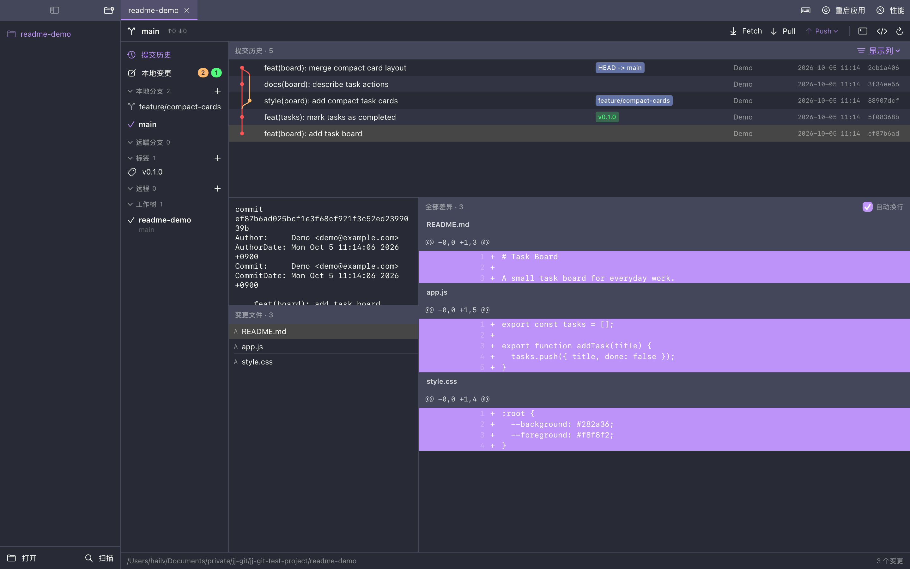
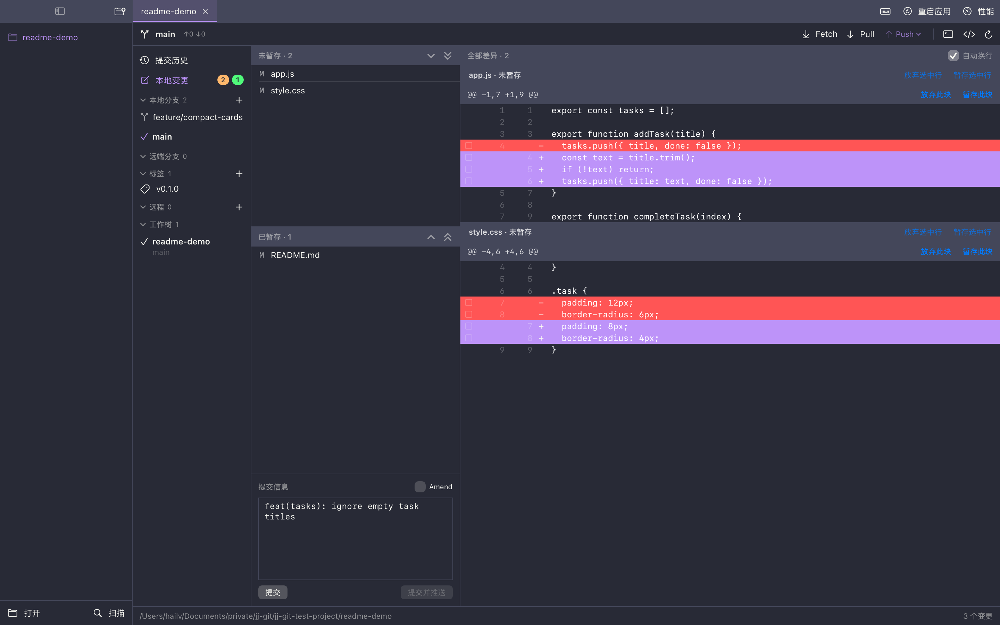

# jj-git

以快速响应、紧凑交互和长期稳定运行为核心的 macOS 原生 Git 客户端。

- **精简轻量**：仅保留高频 Git 操作，以简洁、稳定和极低资源占用为设计目标。
- **快速响应**：Git 操作在后台执行，支持取消与超时，保持界面可交互。
- **紧凑高效**：多仓库标签、可调分栏与连续差异视图，减少窗口切换与逐文件操作。
- **自动同步**：监听文件变化并刷新仓库状态，支持 Worktree 的独立工作目录与共享 Git 数据。
- **长期运行**：闲置标签释放仓库数据，命令日志自动轮转，控制持续运行的资源占用。

## 界面

<!-- prettier-ignore -->
| 提交历史 | 本地变更 |
| --- | --- |
|  |  |

演示仓库的应用界面；点击图片可查看原图。

## 核心功能

- **仓库与 Worktree**：批量导入、分组、多标签、最近仓库筛选、Worktree 切换，恢复标签与窗口布局。
- **提交历史**：提交图、分支与标签、提交详情，多文件差异连续展示。
- **变更与提交**：按文件、差异块或行暂存与取消暂存，放弃变更、Amend、提交并推送。
- **分支与同步**：分支、标签与远程管理，Fetch / Pull / Push，支持 rebase + autostash 与 force-with-lease。

Swift + SwiftUI / macOS 14+ / Dracula 深色主题。
